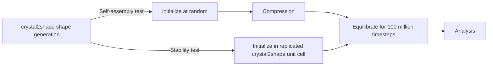

# Project Notes: 

## Equilibration/Compression HPMC Code 

### Overview of Workflow 

Workflow encoded in workflow.toml file using grouping: 



### Additional details 

1. Crystal2shape generation 

    This creates the inputs to the compression and self-assembly code. The "inputs" folder includes folders for each crystal structure to test. Each should include: 
    * the cif file used to generate the shapes  
    * the json files for each atoms shape 
    * the final unit cell file (naming convention: {spacegroup_molecule_0}_nvt_final_pf0p6_0.gsd)

    **NOTE**: this should perhaps be automated/added to the cluster at some point. 

2. Initialize 

    * at random 

        Lattice is created by spacing far enough that they don't overlap on a cubic lattice. The The spacing is the diameter of the minimal bounding sphere of the larger of the two shapes. The necessary stoichiometry to create the unit cell is observed ($N_{\text{type}} = N_{\text{atom in uc}} * \text{replicas}^3$) and the particles are placed first all of one type and then the other.  

        The simulation is run for 4000 timesteps with initial move size of $a = 0.2$ and $d = 0.5$ in order to randomize positions and mix of different species in the box (I decided that this was enough to thoroughly mix by eye). 

        Frame containing lattice and type information (but no shape info) is appended to a temporary GSD file. 

    * in replicated crystal2shape unit cell

        GSD file of final unit cell positions and orientations of crystal2shape shapes in initialized as a simulation, and replicated by amount specified in statepoint. This state is written to GSD file without shape info. 

    After positions are determined, initialize() creates simulation from each job, and adds shape information. This is done like this because "create_simulation" util is generalized to take any gsd file. 

    Because of problems I had with adding wrong shapes into folder, it checks if there are overlaps before writing to correct "initialize.gsd" and writes to "initialize_overlaps.gsd" if there are overlaps. 


3. Compression 

    * initializes simulation from randomized file 
    * two tuners: a MoveSize tuner which triggers every 100 steps for when the box is actively being compressed, and a MoveSize tuner for when the box is equilibrating between steps which triggers every 100 but only for the first 5000 steps. The target is 0.3 for both. 
    * Each compression step decreases box size by 0.01%, appends a quickcompress updater, appends the compression tuner *IF the simulation box is above 0.1*, and runs simulation 100 steps at a time, checking if walltime is complete between each step. The compression updater is removed, the equilibriation tuner is added and the simulation runs for 50,000 steps. 
    * after each 100 steps during comp and 1000 steps during equilib, I check the walltime and create "timeout_config.gsd" if it triggers. I also write info on the job doc if it times out. 
    * after compression ends, the state is written to compress.gsd, and the step, walltime and final pf to job doc. The step is used in other parts of code.

4. Equilibrate for 100 million timesteps (with MPI parallelization)
    * import hoomd at beginning of mpi job
    * set walltime limits with 10 min buffer 
    * set paritioning for MPI processing 
    * SET DEVICE with communicator, necessary for adding device.notice statements instead of print statements 
    * Check which file you're equilibrating from: 

    ```mermaid
    flowchart LR
    comp[Self-assembly job] --> |beginning long equilib| initcomp[initialize.gsd]
    stab[Stability job] --> |beginning long equilib| inits[initialize.gsd]
    comp <--> |or| stab
    comp --> |continuing| restartcomp[restart.gsd]
    initcomp --> compsim[sim_time includes prior compression step]
    restartcomp --> compsim[sim_time includes prior compression step]
    stab[Stability job] --> |continuing| restarts[restart.gsd]
    inits --> stabsim[sim_time is run_time from doc]
    restarts --> stabsim[sim_time is run_time from doc]
    
    ```


### Errors/sticking points 

1. Crystal2shape generation 

2. Initialize 
    * briefly lost correct shape files for correct unit cells, this creates overlaps when initialized. 
    * note: runs with for loop, which runs jobs in serial. 
    
    **difficulty** 
    * writing code which was general enough to take both initialized lattice and . 
    * randomizing enough 
    * efficiently calculating and using shape properties 

3. Compression 

    * jobs were running in serial --> changed workflow.toml to have a maximum group size of one. 
    * if you have a volume fraction condition which needs to start above the compression step but is also checked below the compression step, it needs to be a boolean, etc, because the check after compression will trigger first. (had this problem with tuners)
    * walltime buffer of 5 min hasn't been enough, best practice is 10 min for long runs

    **difficulties**
    * Getting the tuners to work, both understanding how to add them to the compression and also that you needed separate triggers for equilibration and active compression. Also understanding that they were essentially useless in the ideal gas, dilute limit (thank you Jen!). 

4. Equilibrate for 100 million timesteps (with MPI parallelization)

    * forgot to add communicator to create_simulation util for initializing stability test equilib, which meant for those jobs the partitions were all communicating. This error led to very varied behavior when jobs were submitted, because only 1 of 4 create_sim options had this problem. 

    **difficulties from MPI specifically:** 
    * device.notice --> I was initially a bit confused, but I think the tutorials are actually pretty clear. 