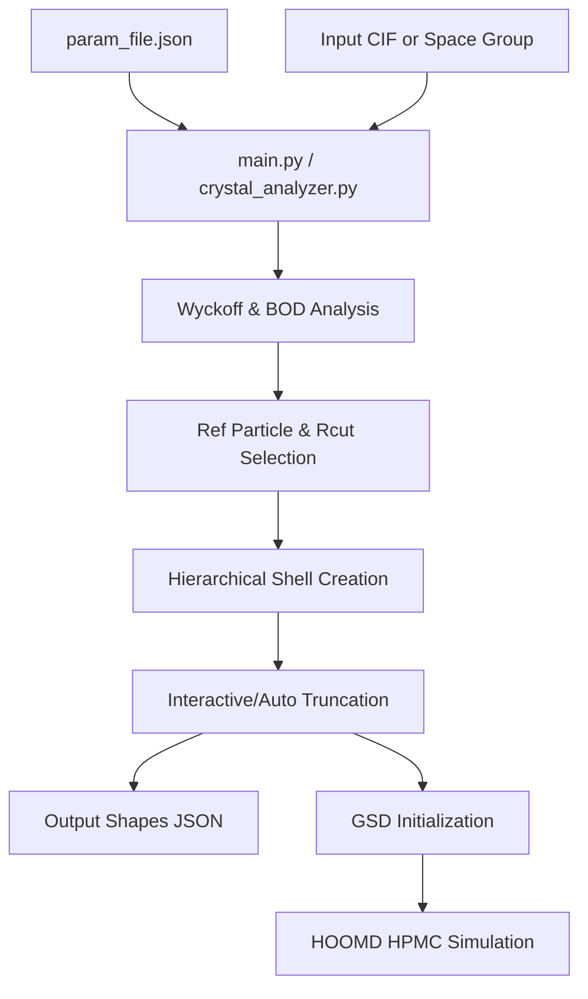

# Crystal2shape
Welcome to the **Crystal2Shape** developer and user documentation. This guide provides a comprehensive overview of the repository's design, pipeline architecture, individual modules, configuration settings, and execution flow.

## Overview
This framework derives anisotropic polyhedral geometries directly from the crystallographic site symmetries of target space groups to program the self-assembly of particles into target crystal structures. Scalable to both single- and multi-component systems, this approach establishes a strict one-to-one mapping between the number of unique polyhedral building blocks and the distinct atomic species in the parent lattice.


## Installations
Install the following Python packages

+ Numpy
+ Scipy
+ Scikit-learn
+ Scikit-spatial
+ Matplotlib
+ Freud
+ Coxeter
+ Rowan
+ GSD
+ Hoomd-Blue (Optional)
+ Geometry3D
+ ASE
+ Pymatgen
+ Spglib
+ PyVista
+ Parsnip

## Usages
Make all the parameter changes in the "param_file.json"

Run the "main.py" file 

```
$ python3 main.py
```

## Examples

First, import the "CrystalAnalyzer" package
```
import crystal_analyzer
```

From the CIF file, prepare the system to analyze
```
analyzer.prepare_system()
```

Evaluate the symmetry, Wyckoff sites of the crystal structure
```
analyzer.analyze_symmetry()
```

Choose the reference lattice site, cutoff distance followed by the extraction of the shape from the structure.
```
shapes, types = analyzer.generate_shapes()
```

Store the shape vertices as JSON files
```
analyzer._JSON_writer(shapes, types)
```

## Additional usages
Install HOOMD-Blue to run the "quick-compression" simulation to construct the unit cell using the polyhedral shapes
```
analyzer.run_simulations(shapes, types)
```

---
## Description

**Crystal2Shape** is a Python-based pipeline designed to:
1.  **Parse Crystal Structures**: Import structure definitions from Crystallographic Information Files (`.cif`) or generate them from space group parameters.
2.  **Symmetry and Wyckoff Analysis**: Calculate local coordinate environments and Wyckoff positions using radial distribution functions (RDF) and Bond Order Diagrams (BOD).
3.  **Construct Information Polyhedra**: Find reference particles and calculate optimal cutoffs to maintain local site symmetries.
4.  **Hierarchical Truncation**: Perform systematic plane-cut operations along coordinate shell hierarchies to generate representative coordination shapes.
5.  **HOOMD-blue Simulations**: Run Hard Particle Monte Carlo (HPMC) quick-compressions and NVT simulations to study shape packing.



---

## 2. Codebase Directory Structure

The repository is structured as a modular Python package under the `src` directory, managed by a main pipeline controller:

```text
crystal2shape-dev/
├── crystal_analyzer.py      # Main pipeline controller class
├── main.py                  # Pipeline execution entry point script
├── param_file.json          # Configuration parameters file
├── PointGroupOrder.json     # Point group order definitions database
├── environment.yml          # Micromamba/Conda dependencies specification
├── documentation/           # Markdown and visual documentation files
│   ├── codebase_documentation.md  # Detailed codebase architecture
│   └── param_file_description.md   # Parameter definition details
└── src/                     # Core package package source
    ├── __init__.py
    ├── environment/         # RDF, BOD, and local environment clustering
    ├── hoomd_hpmc/          # HOOMD-blue integration and simulation controllers
    ├── operations/          # Polyhedral truncation and face merging
    ├── reader_writer/       # GSD/JSON writers and CIF parser
    ├── symmetry/            # Space group / point group analyzers
    ├── utils/               # Coordinate wrapping, hierarchy trees, and asymmetric units
    └── visualization/       # PyVista and plotting controllers
```

---

## 3. Module Breakdown

### 3.1 Pipeline Controller & Entry Point

*   **[`main.py`](file://crystal2shape/crystal2shape-dev/main.py)**: The entry point script that instantiates `CrystalAnalyzer`, loads configuration variables, and coordinates the sequential execution steps (prepare, analyze, shape generation, JSON writing, and HOOMD simulation).
*   **[`crystal_analyzer.py`](file://crystal2shape/crystal2shape-dev/crystal_analyzer.py)**: The central orchestration class `CrystalAnalyzer`. It coordinates imports, triggers the Wyckoff solver, calculates truncation ratios, executes shape construction, and handles simulated compression runs.

### 3.2 Symmetry Analysis (`src/symmetry/`)

*   **[`wyckoff.py`](file://crystal2shape/crystal2shape-dev/src/symmetry/wyckoff.py)**: Contains the `WyckoffAnalyzer` class which aggregates particles into coordinate shells and assigns Wyckoff labels using `spglib` metadata or Pymatgen point group fallbacks.
*   **[`detect_pg.py`](file://crystal2shape/crystal2shape-dev/src/symmetry/detect_pg.py)**: Helper routines to parse and identify Schoenflies point groups from coordinate point sets.

### 3.3 Local Environments (`src/environment/`)

*   **[`rdf.py`](file://crystal2shape/crystal2shape-dev/src/environment/rdf.py)**: Calculates the Radial Distribution Function of coordinates using `freud` to identify nearest-neighbor shell distances.
*   **[`bod.py`](file://crystal2shape/crystal2shape-dev/src/environment/bod.py)**: Constructs Bond Order Diagrams (BOD) to analyze local angular alignments and signatures.

### 3.4 Math & Shape Utilities (`src/utils/`)

*   **[`utils_func.py`](file://crystal2shape/crystal2shape-dev/src/utils/utils_func.py)**: Houses internal helper utilities for coordinate box wrapping, distance queries, moments of inertia, dual polyhedra definitions, and covariance eigenvectors.
*   **[`calc_ref_particle_rcut.py`](file://crystal2shape/crystal2shape-dev/src/utils/calc_ref_particle_rcut.py)**: Calculates the reference atom IDs and the optimal starting cutoff distance (`rcut`) required to preserve Wyckoff multiplicities and target local point group symmetries.
*   **[`make_hierarchy.py`](file://crystal2shape/crystal2shape-dev/src/utils/make_hierarchy.py)**: Classes to group neighbor points into radial shell lineages starting from the central reference particle and extending outwards.
*   **[`hierarchy_truncation.py`](file://crystal2shape/crystal2shape-dev/src/utils/hierarchy_truncation.py)**: Executes systematic perpendicular plane slicing along coordinate lineage lines.
*   **[`find_asymmetric_unit.py`](file://crystal2shape/crystal2shape-dev/src/utils/find_asymmetric_unit.py)**: Identifies the asymmetric unit nodes and replicates them through lattice translation combinations to check unit-cell coverage.
*   **[`get_shape.py`](file://crystal2shape/crystal2shape-dev/src/utils/get_shape.py)**: Runs the core iterative truncation pipeline, querying the user for shell cutoffs (`rcut_wyckoff`) and outputting final polyhedral vertex lists.

### 3.5 Slicing Operations (`src/operations/`)

*   **[`truncation.py`](file://crystal2shape/crystal2shape-dev/src/operations/truncation.py)**: Defines geometric plane-slicing algorithms on convex hulls.
*   **[`convex_intersection.py`](file://crystal2shape/crystal2shape-dev/src/operations/convex_intersection.py)**: Performs boolean intersections of convex shape objects.
*   **[`merge_faces.py`](file://crystal2shape/crystal2shape-dev/src/operations/merge_faces.py)**: Utility to simplify output polyhedral representations by merging coplanar faces.

### 3.6 File Readers and Writers (`src/reader_writer/`)

*   **[`cif_reader.py`](file://crystal2shape/crystal2shape-dev/src/reader_writer/cif_reader.py)**: Imports CIF structure data using `pymatgen`.
*   **[`prepare_box.py`](file://crystal2shape/crystal2shape-dev/src/reader_writer/prepare_box.py)**: Configures periodic boundary dimensions and wraps coordinates for simulation boxes.
*   **[`json_writer.py`](file://crystal2shape/crystal2shape-dev/src/reader_writer/json_writer.py)**: Exports finalized polyhedral shape coordinate files.
*   **[`gsd_writer.py`](file://crystal2shape/crystal2shape-dev/src/reader_writer/gsd_writer.py)**: Creates binary GSD files representing initial crystal packing states for HOOMD-blue.

### 3.7 HOOMD Blue Simulation (`src/hoomd_hpmc/`)

*   **[`hoomd_quickcompress.py`](file://crystal2shape/crystal2shape-dev/src/hoomd_hpmc/hoomd_quickcompress.py)**: Manages quick HPMC compression runs to raise target packing densities while preventing particle overlaps.
*   **[`hpmc_nvt.py`](file://crystal2shape/crystal2shape-dev/src/hoomd_hpmc/hpmc_nvt.py)**: Runs canonical NVT ensemble simulations with rotational and translational springs.

### 3.8 Visualizations (`src/visualization/`)

*   **[`pyvista_plot.py`](file://crystal2shape/crystal2shape-dev/src/visualization/pyvista_plot.py)**: Generates 3D plots of lattices, coordinates, and polyhedra using PyVista.
*   **[`plot_hierarchy.py`](file://crystal2shape/crystal2shape-dev/src/visualization/plot_hierarchy.py)**: Specialized plotter for shell hierarchies.

---

## 4. Run Configurations

### 4.1 Dependency Setup
Ensure your local Python environment is correctly activated with the required dependencies (such as `pymatgen`, `freud-analysis`, `coxeter`, `scipy`, `spglib`, `rowan`, and `hoomd`).

If using `micromamba`, activate your `User` environment:
```bash
micromamba activate User
```

### 4.2 How to Execute

To execute the pipeline:
```bash
python3 main.py
```

### 4.3 Handling Interactive Prompts
By default, the script triggers interactive prompts to select reference particles and shell cutoffs:
```text
Reference particle ID (integer): 0
Enter rcut_wyckoff for Ga: 1.192
```

> [!TIP]
> **Fully Automated Mode**: If you are running the script in a non-interactive shell (like a cron job or background runner), pass `auto_select=True` in `main.py` when calling `generate_shapes` to bypass interactive prompts and default to first-found basis structures:
> ```python
> shapes, types, ref_particles, envelopes = analyzer.generate_shapes(auto_select=True)
> ```

---

## 5. Outputs Generated

The following directories and files are populated during runtime:
- **`temp_files/`**: Created under the configured base directory. Stores output `.gsd` snapshots, `.json` shape vertex collections, and PyVista rendering images (`.png`).
- **Standard Out**: Logs progress updates, optimization logs per atom type, and validation metrics (moment of inertia difference, unit cell total symmetry orders).
