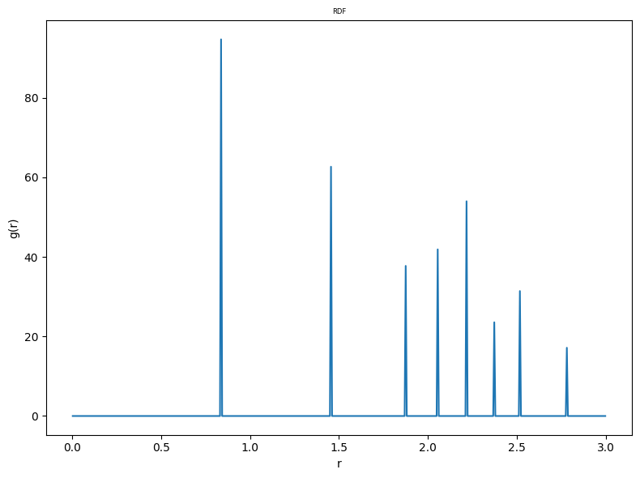

This script reads a CIF file, extracts the crystal structure information, and computes the shape of the information polyhedron around atoms in the structure. It uses various libraries for data manipulation, visualization, and geometric computations.
It also computes the moment of inertia of the shape and writes the results in a JSON file.

Protocol:
---------
1. Read a JSON file containing parameters for the CIF file and other settings.
2. Use the cif_reader to read the CIF file and extract the crystal structure information.
3. Compute Wyckoff positions using the symmetry information from the CIF file.
4. For each atom type in the unit cell, compute the reference particle and cutoff distance to include 
   the information of all lattice sites in the unit cell

   (i) For crystal with multiple Wyckoff sites, consider the minimum distance from the atom such that
   Wyckoff ratio is conserved, Choose that atom as the reference atom.

5. Compute the shape of the information polyhedron around the atoms, considering their local environments.
6. Construct the hierarchy levels
7. Determine the level upto which the hierarchical truncation would occur
8. Get the shape information and save as a JSON file


```python
import numpy as np
import os
import freud, json, coxeter, rowan
from scipy.spatial import ConvexHull
import random
from itertools import chain


from crys2shape.reader_writer import cif_reader, json_writer
from crys2shape.symmetry import wyckoff
from crys2shape.utils import get_shape
from crys2shape.visualization import pyvista_plot
from crys2shape.reader_writer import gsd_writer
from crys2shape.utils import cleanup_poly_vertices
from crys2shape.symmetry import detect_pg
from crys2shape.utils import calc_ref_particle_rcut
from crys2shape.utils import construct_unit_cell
from crys2shape.operations import convex_intersection
```

### Read JSON file
This JSON file contains the parameters for the CIF file and other settings

The JSON file should be in the same directory as this script

The JSON file should contain the following


```python
input_path = "./"
input_file = input_path + "param_file.json"
with open(input_file) as json_file:
    data = json.load(json_file)

directory = input_path + data["directory"]
space_group_number = data["space_group_number"]
CIF_file = data["input_CIF"]
space_group_number = data["space_group_number"]
type_arr = data["type_arr"]
radii_arr = data["radii_arr"]
tr_pt = data["tr_pt"] # Truncation point (float) of the atoms in the system
target_pf = data["target_pf"] # Target packing fraction (float)
target_volume = data["target_volume"] # Target volume (list) of the unit cell [Lx, Ly, Lz] (float)


input_CIF = directory + data["input_CIF"]
name, file_extension = os.path.splitext(CIF_file)
shape_id = name
```

### CIF reader


```python
num_replicas = 3 # Number of replicas in each direction
CIF_reader_obj = cif_reader.CIF_reader(input_CIF)
CIF_reader_obj._CIF_reader_func(num_replicas, target_pf)

# Attributes of CIF_reader
uc_box = CIF_reader_obj.uc_box_ # Unit cell box (freud.Box)
pos = CIF_reader_obj.pos # Positions of atoms in the unit cell (numpy array)
box_arr = CIF_reader_obj.box_arr # Box array of the system (freud.Box)
positions = CIF_reader_obj.positions # Positions of atoms in the entire system (numpy array)
original_positions = CIF_reader_obj.original_positions # Original positions of atoms in the unit cell (numpy array)
aq = CIF_reader_obj.aq # Freud system object
particleids = CIF_reader_obj.particleids # Particle IDs of atoms in the entire system (numpy array)
original_particleids = CIF_reader_obj.original_particleids # Original particle IDs of atoms in the unit cell (numpy array)
uc_particle_ids = CIF_reader_obj.uc_particle_indices # Indices of atoms in the unit cell (numpy array)
latt_vectors = CIF_reader_obj.latt_vectors # Lattice vectors of the unit cell (numpy array)
atom_type_ = CIF_reader_obj.atom_type_ # Atomic type (String) of atoms in the unit cell
basis_type_ = CIF_reader_obj.basis_type_ # Basis type (String) of atoms in the unit cell
original_basis_type_ = CIF_reader_obj.original_basis_type_ # Unique types (String) of basis atoms in the unit cell
sys_types = CIF_reader_obj.sys_types # Type-ids (Integer) of each atom in the entire system replicated in the entire system
uc_indices = CIF_reader_obj.uc_indices # Indices (integer) of atoms in the entire system replicated in the entire system
```

    Cell([4.10795572, 4.10795572, 4.10795572]) 8
    UC particle ids :  [0, 27, 54, 81, 108, 135, 162, 189]


### Get the box info and systemwise particle types


```python
box_arr_list = box_arr.to_matrix() # Convert freud.Box to numpy array
uc_box_list = uc_box.to_matrix() # Convert freud.Box to numpy array

# Get the system wise atom types
uc = freud.data.UnitCell(uc_box, basis_positions=pos)
n_repeats = (num_replicas, num_replicas, num_replicas)  # Number of replicas in each direction
system = uc.generate_system(n_repeats)
N = np.prod(n_repeats)
indices = np.repeat(np.arange(len(uc.basis_positions)), N)
sys_types = np.array(sys_types)[indices]
sys_types = [basis_type_[i] for i in sys_types]
```

### Wyckoff info
Get the Wyckoff information for all atoms (single/multiple types) in the system.

It prints the site symmetry of all atoms in the unit cell with atom ids in the original system

It calculates the number of atoms for different site symmetries. If multiple atoa types are there,
it prints the same info for differnet types of atoms


```python
rmax, bins = 3, 500  # Set rmax and bins for RDF calculation or change it if necessary
wyckoff_obj = wyckoff.wyckoff()
wyckoff_obj._wyckoff_func(positions,
                           box_arr=box_arr,
                           uc_box=uc_box,
                           uc_particle_indices=uc_particle_ids,
                           basis_type_=basis_type_,
                           sys_types=sys_types,
                           rmax=rmax,
                           bins=bins)
# Attributes of wyckoff
neighbor_posi_uc = wyckoff_obj.neighbor_posi_uc
symm_cntr = wyckoff_obj.symm_cntr
symm_arr = wyckoff_obj.symm_arr
symm_cntr_per_type = wyckoff_obj.symm_cntr_per_type
position_arr = wyckoff_obj.position_arr
separation_arr = wyckoff_obj.separation_arr

```


    

    


    Enter rcut :  1.5


    0 D3
    27 D3
    54 D3
    81 D3
    108 D3
    135 D3
    162 D3
    189 D3
    Wyckoff info :  {'D3': 8}
    Wyckoff per type:  [{'D3': 8}]


### Get Wyckoff positions of each atom in the entire system
This is done by repeating the Wyckoff positions for each replica of the unit cell


```python
# Get Wyckoff positions systemwise
symm_keys = list(symm_cntr.keys())
symm_arr_index = [[k for k, e in enumerate(symm_keys) if e == i] for i in symm_arr]
sys_wyckoff = list(chain.from_iterable(np.array(symm_arr_index)[indices]))
sys_wyckoff = [symm_keys[i] for i in sys_wyckoff]
```

### Unit cell particle positions


```python
posi_uc = [positions[t] for t in uc_particle_ids]
```

### Get the reference particle, cutoff distance, construct the hierarchy, make hierarchical truncation and finally get the shape for each atom type

#### Get the reference particle and cutoff distance

(i) For crystal with single Wyckoff site (considering single atom type), start from each atom to find the minimum cutoff distance to include all lattice sites of the unit cell (considering PBC)

(ii) For example, starting from $P_1$, the distance is $r_1$, from $P_2$, the distance is $r_2$ ......., one should choose min{$r_i$}, the reference particle would be $P_i$ corresponding to min{$r_i$}

(iii) If $r_i$s are same for all the particles, choose the $P_i$ with highest order of site symmetry. So, the level of filtering for the reference particle is : first distance then the order of site symmetry.

(iv) For the crystal with Multiple Wyckoff positions, the min{$r_i$} would include the particles such that it maintains Wyckoff ratio conservation in the unit cell.

#### Construct the Information polyhedron

(i) Starting from the reference particle ($P_{ref}$), get all the particles in the system within $r_{cut}$. The Information polyhedron (IP) would be the convex hull of the coordinates. The IP is defined with respect to the $P_{ref}$

#### Make hierarchy

(i) Consider all the points in the IP including the particle staying inside of the IP. Starting from the $P_{ref}$, the hierarchy would look like following --

$P_{ref}$ -- $P_1$ -- $P_2$ -- $P_3$

$P_{ref}$ -- $P_4$ -- $P_5$ -- $P_6$

$P_{ref}$ -- $P_7$ -- $P_8$ -- $P_9$

$P_{ref}$ -- $P_10$ -- $P_11$

$P_{ref}$ -- $P_12$

The particles connected to $P_{ref}$ is Level-1 hierarchy, the next level is Level-2 hierarchy and so on.

For the crystal structure with multiple Wyckoff sites, first we make the hierarchy considering the particles within the cutoff distance where Wyckoff ratio is conserved. In this case, we need to truncate at the level where Wyckoff ratio is conserved.

For the crystal structure with single Wyckoff site, the truncation level would be 1 as we need to consider all the particles i.e. all the unit cell particles are important to construct the crystal structure.


#### Hierarchical truncation


```python
shape_vertices_list, ref_particle_list, hierarchy_list, info_poly_coords_list, info_poly_particle_ids_list = [], [], [], [], []
for counter in range(len(basis_type_)):
    atom_type = basis_type_[counter]  # Current atom type
    indices_per_type = [k for k, e in enumerate(sys_types) if e == atom_type]
    positions_per_type = [positions[t] for t in indices_per_type]
    uc_particle_ids_type = [u for u in uc_particle_ids if sys_types[u] == atom_type]

    # Per atom type Wyckoff conservaton, not other types
    w_keys_type = list(symm_cntr_per_type[counter].keys())
    w_values_type = list(symm_cntr_per_type[counter].values())
    
    calc_ref_particle_rcut_obj = calc_ref_particle_rcut.calc_ref_particle_rcut_class()
    calc_ref_particle_rcut_obj.compute(positions_per_type, box_arr, 
                    uc_box, 
                    uc_particle_ids_type,
                    uc_particle_ids,
                    w_keys_type, 
                    w_values_type,
                    sys_wyckoff,  
                    sys_types, 
                    latt_vectors,  
                    atom_type=atom_type,
                    rmax=3.0, 
                    bins=500,
                    rounding_factor=2)

    # Attributes of get_shape
    ref_particle = calc_ref_particle_rcut_obj.ref_particle
    rcut = calc_ref_particle_rcut_obj.rcut
    ref_particle_arr = calc_ref_particle_rcut_obj.ref_particle_arr
    rcut_arr = calc_ref_particle_rcut_obj.rcut_arr

    tr_pt_type = tr_pt[counter]  # Truncation point for the current type
    shape_vertices_arr, hierarchy, info_poly_coords_arr, info_poly_particle_ids_arr = [], [], [], []
    while ref_particle != -1:
        ref_particle = int(input("Reference particle ID (integer): "))
        # Get shape_poly obtained by truncating the info polyhedron
        shape_obj = get_shape.get_shape_class()
        shape_obj.get_shape(sys_types, sys_wyckoff, box_arr, uc_box, 
                            positions_per_type, tr_pt_type, 
                            ref_particle, rcut, atom_type, uc_particle_ids_type,  
                            uc_particle_ids_type, ref_particle_arr, rcut_arr, radii_arr, 
                            type_arr, rounding_factor=2, show_hierarchy=True, show_voronoi=False)

        shape_poly = shape_obj.shape_poly
        ref_particle = shape_obj.ref_particle
        hierarchy_arr = shape_obj.hierarchy_arr
        info_poly_coords = shape_obj.info_poly_coords
        info_poly_particle_ids = shape_obj.info_poly_particle_ids
        
        shape_poly = [(t - np.average(shape_poly, axis=0)) for t in shape_poly]
        shape_poly = [t for t in shape_poly]
        hull = ConvexHull(shape_poly)
        shape_poly = np.array(shape_poly) * (target_volume[counter]/hull.volume)**(1/3)  # Normalize the shape poly vertices
        shape_poly = [t.tolist() for t in shape_poly]
        hierarchy.append(hierarchy_arr)
        shape_vertices_arr.append(shape_poly)
        info_poly_coords_arr.append(info_poly_coords)
        info_poly_particle_ids_arr.append(info_poly_particle_ids)

        # Visualize shape
        '''poly_vertices = [np.array(shape_poly)+ positions[ref_particle[0]]]
        pyvista_plot_obj = pyvista_plot.pyvista_plot_class(uc_box=uc_box, positions=posi_uc, lattice_sites=None, poly_vertices=poly_vertices, extra_positions=None, line_points=None)
        pyvista_plot_obj.pyvista_plot_func()'''
        
        # exit()
        break

    ref_particle_list.append(ref_particle_arr)
    shape_vertices_list.append(shape_vertices_arr)
    hierarchy_list.append(hierarchy)
    info_poly_coords_list.append(info_poly_coords_arr)
    info_poly_particle_ids_list.append(info_poly_particle_ids_arr)

    counter += 1
```


    

    


    Enter rcut :  1.5


    C ['D3']
    0 2.05 D3
    27 2.05 D3
    54 2.05 D3
    81 2.05 D3
    108 2.05 D3
    135 2.05 D3
    162 2.05 D3
    189 2.05 D3
    ref particle and rcut :  0 2.05


    Reference particle ID (integer):  0


    Max hierarchy length for Wyckoff conservation:  4
    rcuts of info poly:  2.05
    rcuts of info poly for same type:  2.05


    Widget(value='<iframe id="pyvista-jupyter_trame__template_P_0x309354c20_0" src="http://localhost:8888/trame-ju…


    Max hierarchy length :  4
    Message: If 'Max hierarchy length for Wyckoff conservation' is equal to 'Max hierarchy length', then enter the value 1 
    otherwise enter the value of the 'Max hierarchy length for Wyckoff conservation'.


    Enter the level of hierarchy :  1


    Widget(value='<iframe id="pyvista-jupyter_trame__template_P_0x3293c4690_0" src="http://localhost:8888/trame-ju…


    Widget(value='<iframe id="pyvista-jupyter_trame__template_P_0x3293c4f50_0" src="http://localhost:8888/trame-ju…


### Construct the unit cell using the shape vertices and orientations


```python
'''uc_positions = [positions[t] for t in uc_ids]
construct_unit_cell_obj = construct_unit_cell.ConstructUnitCell(uc_positions, positions, box_arr, uc_box, target_pf, hierarchy_list, ref_particle_list, 
                                shape_vertices_list, group_arr, uc_ids, type_arr, basis_type_, sys_types, pos, target_volume)
construct_unit_cell_obj.construct_unit_cell_func()

vertices_arr = construct_unit_cell_obj.vertices_arr
uc_orientations = construct_unit_cell_obj.orientations
box = construct_unit_cell_obj.box
uc_positions = construct_unit_cell_obj.positions
types = construct_unit_cell_obj.types
typeids = construct_unit_cell_obj.typeids
shape_dic = construct_unit_cell_obj.shape_dic
uc_box = [box.Lx, box.Ly, box.Lz, box.xy, box.xz, box.yz]'''
```

### Write JSON file


```python
vertices_arr = shape_vertices_list[0]
counter = 0
for vertices in vertices_arr:
    JSON_writer_obj = json_writer.JSON_writer()
    JSON_writer_obj.JSON_writer_func(vertices, shape_id, directory, basis_type_, counter)
    counter += 1
```

### Write HTML file for the shape


```python
'''shape_obj = shape.shape_class(poly_vertices=np.array(vertices_arr[0]), filename=directory + shape_id + "_shape" + ".html")
shape_obj.shape_func()'''
```

### Write GSD file


```python
'''gsd_write_obj = gsd_writer.GSDWriter(filename=directory + shape_id + "_uc" + ".gsd")
gsd_write_obj.write_GSD(box, uc_positions, uc_orientations, typeids, types, shape_dic)'''
```
